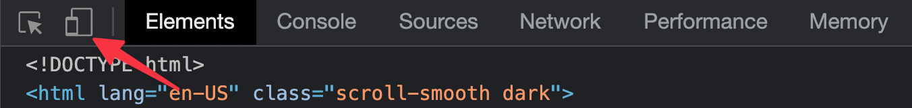
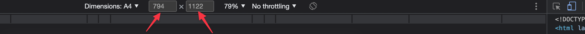

# PDF generation

You can use DevsCard to generate a PDF version of your resume.
To do it, invoke the `npm run generate-pdf` command from the project's root and look to `public/cv.pdf` for the result.

## Customizing the data

PDF generation script takes data from the same files your web resume does. However, it applies a few modifications:

- For `main-section.data.ts` and projects in `portfolio-section.data.ts` you can define a separate property called `pdfDetails`. If specified, it will be used instead of the `details` to render label-value text paris.
- Value of the `links` property is ignored. If you want some URLs to be present in PDF, add them as `pdfDetails`.
- There are no testimonials and favorites sections.

You can also provide your own modifications using [data transformers](./data-transformation.md) in the `pdf.astro` file.

## Footer

Sometimes you need to put some text at the bottom of each PDF file (e.g. a data processing clause).

With DevsCard you can achieve it by providing the `pdf.footer` property in the `src/data/config.ts` file.

## Local testing

It might be tedious to run the generate command each time you want to see your changes.

Luckily, a few steps can give you a way to get a live preview of your changes.

1\. Invoke `npm run dev` to start local development server.

2\. Go to `http://localhost:3000/pdf`.

3\. Open developer tools and turn on the Device Mode by clicking the phone icon in the top left corner.

<figure><figcaption></figcaption></figure>

4\. Set device dimensions to 794x1122. Optionally you can save it as the A4 dimensions for further use.

<figure><figcaption></figcaption></figure>

5\. Edit any part of your data of `pdf.astro` to see changes live.

6\. When the result looks satisfying, invoke `npm run generate-pdf` to generate a new PDF file.
