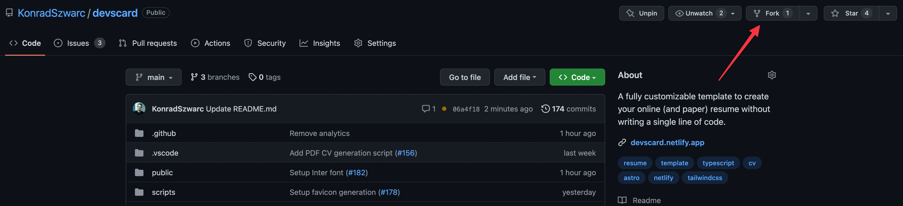
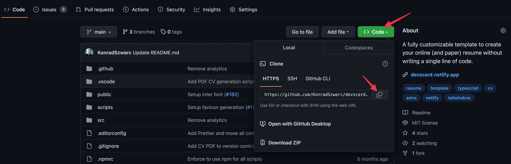
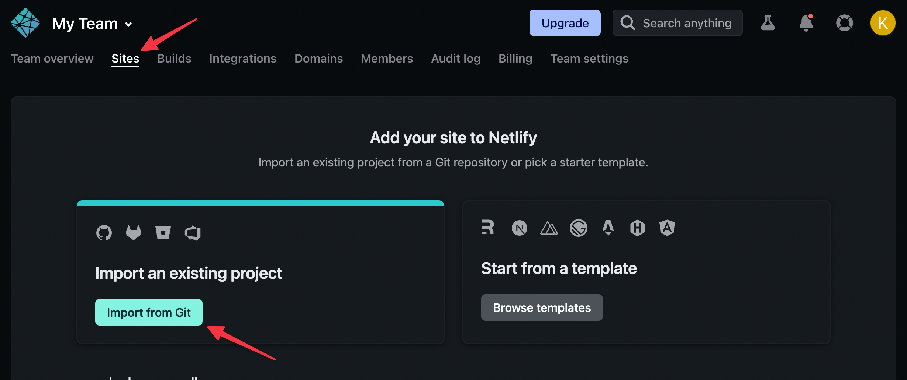
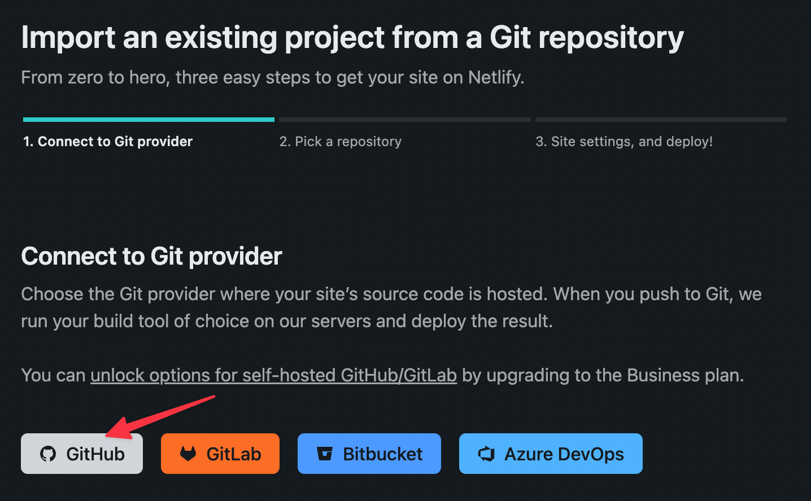
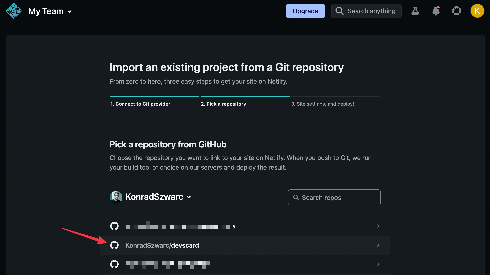
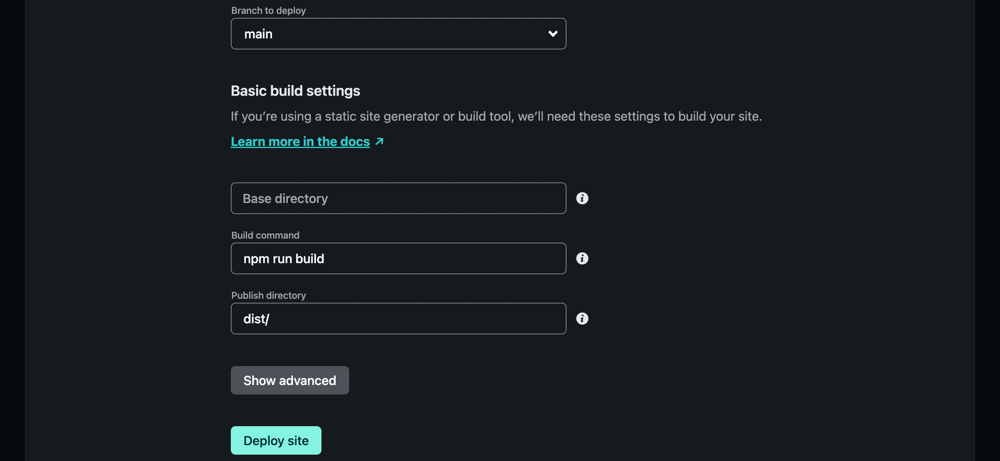
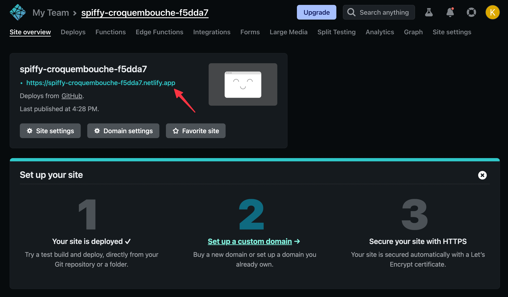

# Setup guide

## 1. Run the project locally

1\. Create a fork of the [project repository](https://github.com/KonradSzwarc/devscard).

<figure><figcaption></figcaption></figure>

2\. Go to the forked repository and clone it to your local machine.

<figure><figcaption></figcaption></figure>

3\. Open the cloned project in your IDE of choice and run `npm install`.

4\. Invoke `npm run dev` in the project's root directory and go to `http://localhost:3000`. You should see a resume website filled with initial data.

## 2. Provide your data

#### Basics

To fill the CV with your data, go to the `src/data` directory. There you should focus on three places:

- `config.ts` — use it to provide metadata of your website and set up its locales.
- `sections` — contains files with data for each section of the resume.
- `helpers` — helper functions you can utilize to reduce the amount of repetitiveness when setting up your socials and skills.
  - `links.ts` — functions that ensure you always use the same icon and name when providing links to external websites. We provide the most popular socials out-of-the-box, so there is a chance you won't edit anything in this file.
  - `skills.ts` — one place where you define your skills to reuse them in multiple sections. You can remove the skills used in the example template and replace them with your own.

#### **Tips**

- You can hover over each configuration property to get its description.
  - Some property descriptions start with `[WEB]` or `[PDF]`. It means those properties are used only in the web/pdf version of the resume.
- Although you can provide URLs for images, we highly recommend putting all images in the `src/assets` directory and importing them using the `import` statement. This way, images will be auto-optimized, so you won't have to worry about their dimensions.
  - To know the aspect ratio of an image, hover over the `image` property.

## 3. Generate PDF (optional)

Within the main section, you will find an `action` property. It allows you to provide a pdf resume to download. If you don't have one, feel free to use our CV generator by invoking `npm run generate-pdf`. Generated resume will be placed in `public/cv.pdf` and use the same data as the web one. You can learn more about PDF generation [here](./pdf-generation.md).

## 4. Deploy to Netlify


As the resume is entirely static, you can deploy it to any hosting provider. In this guide, we use Netlify as it's free and easy to set up.


1\. Create a commit for your CV updates and push it to GitHub.

2\. Create a [Netlify](https://www.netlify.com/) account.

3\. Go to the "Sites" tab and choose "Import from Git".

<figure><figcaption></figcaption></figure>

4\. Connect Netlify with your GitHub account.

<figure><figcaption></figcaption></figure>

5\. Pick a repository with your forked project

<figure><figcaption></figcaption></figure>

6\. On the last step, go with the default settings suggested by Netlify and click "Deploy site".

<figure><figcaption></figcaption></figure>

7\. After around one minute, your resume will be live 🎉

<figure><figcaption></figcaption></figure>

From now on, each push to `main` branch will cause redeploy of the Netlify website. You may want to go to the "Site settings" tab to update your site name or even [set up your domain](https://youtu.be/bY7Tkh9Vz8I).
